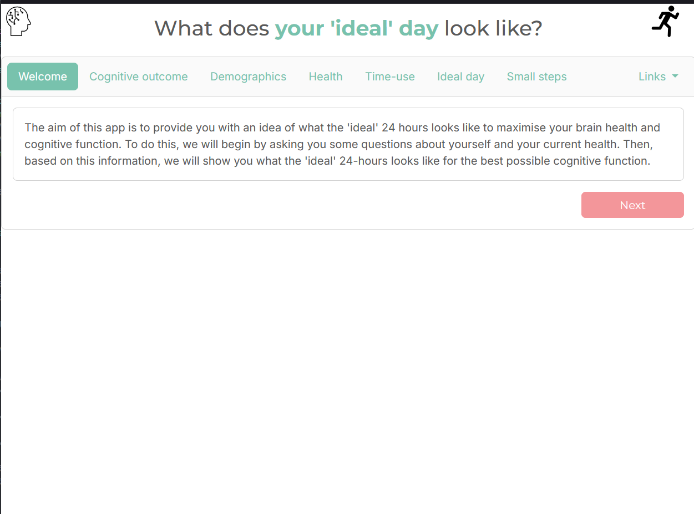
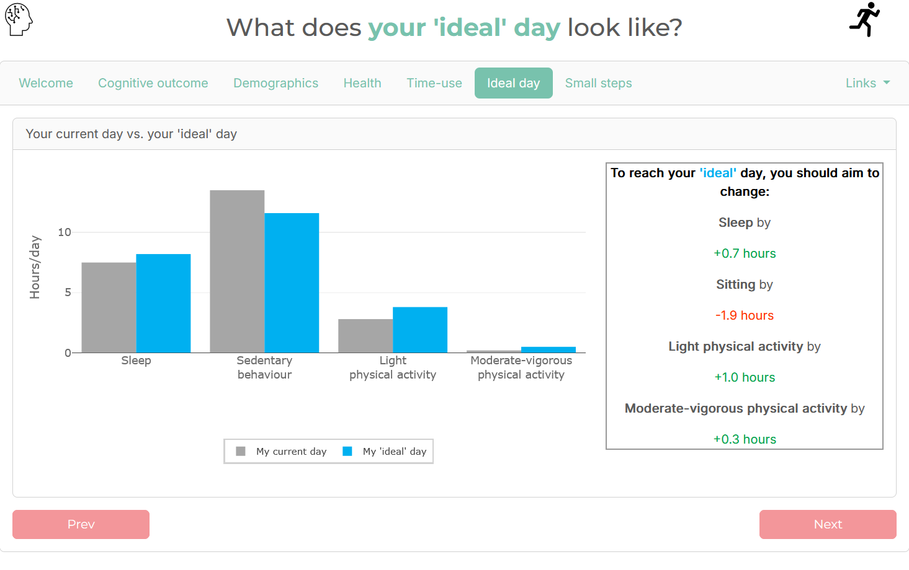
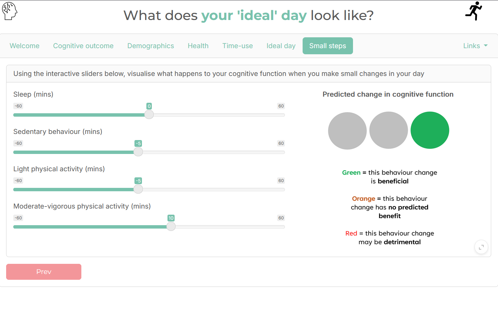

# ideal-day

Shiny app for the Small Steps trial to investigate personalised activity composition changes

Please see the below papers for more details and context:

* "[Co-design of a digital 24-hour time-use intervention with older adults and allied health professionals](https://doi.org/10.3389/fdgth.2025.1544489)". Blake et al. (2025). *Front. Digit. Health.*
* "['Small Steps' towards improving 24-hour time-use behaviours to decrease the risk of
dementia: protocol for a personalised, web-based randomised controlled trial in community-
dwelling older adults](https://doi.org/10.1101/2025.05.26.25328336)". Mellow et al. (2025). *Submitted/under review (link to pre-print).*
* "[An interactive tool to personalise 24-hour activity, sitting and sleep prescription for optimal health outcomes](https://doi.to.follow/)". Mellow et al. (2025). *Submitted/under review (updated link to following publication).*

## Shiny app in action (no installation required)

Hosted at the web location:

* [https://arena2024.shinyapps.io/ideal-day/](https://arena2024.shinyapps.io/ideal-day/)


## Running the Shiny App locally (on your own computer, installation required)

The following steps will allow you to run the `ideal-day` Shiny App on your own computer:

* Make sure you have [R](https://cran.r-project.org/) and [RStudio](https://www.rstudio.com/products/rstudio/download/) installed.
* Download and unzip this Github repository (green `<> Code` button in top right -> `Download ZIP`).
* Double click the `ideal-day.Rproj` file - this should open an RStudio session.
* (only has to be performed once) Make sure the prerequisite packages are installed by running the below command in the R console:
```r
install.packages(
  c(
    "shiny", "shinydashboard", "shinyjs", "bslib",
    "ggplot2", "ggthemes", "viridis" , "plotly"
    "forcats", "dplyr", "lubridate", "readr", "tidyr", "forcats", "purrr",
    "compositions", "expm", "mosaic", "knitr"
  )
)
```
* Now to finally run the Shiny App by running the below command in the R console:
```r
library(shiny)
runApp()
```


## Example screenshots








